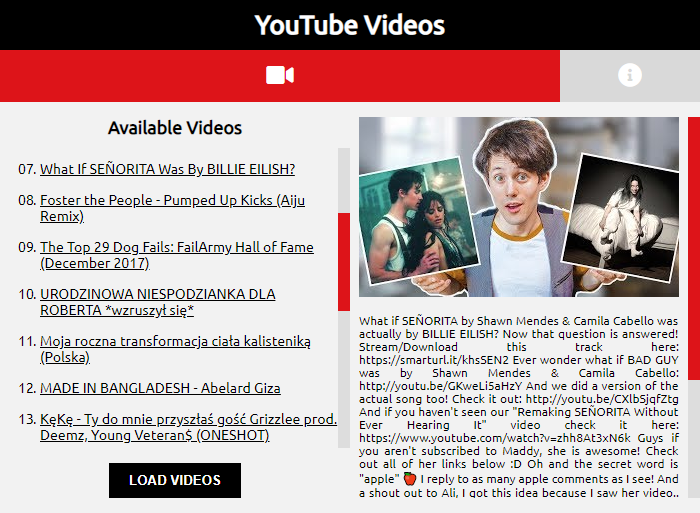

    

## Table of contents
* [General info](#general-info)
* [Code organization](#code-organization)
* [Acknowledgements](#acknowledgements)
* [Setup](#setup)

## General info
This project is a simple Google Chrome Extension for YouTube, which allows user to load YouTube videos titles while beign on [YouTube.com](https://youtube.com) to extension popup and after click on title you can see thumbnail and description of the video.

## Code organization
    .
    ├── css             # Style sheet files
    ├── img             # Images, extension icons
    ├── js              # JavaScript files
    │   ├── background.js       # Background scripts
    │   ├── content.js      # Content scripts
    │   ├── popup.js        # Popup scripts
    │   └── jquery.min.js        
    ├── readme          # Readme content
    ├── index.html          # Popup structure
    ├── manifest.json       # Extension config
    └── README.md

## Acknowledgements
* [Font Awesome](https://fontawesome.com)
* [Google Fonts](https://fonts.google.com)
* [jQuery v3.4.1](https://jquery.com)
    
## Setup
To run extension:
1. On your computer, open Chrome.
2. At the top right, click More > More tools > Extensions
3. Run developer mode
4. Load extension